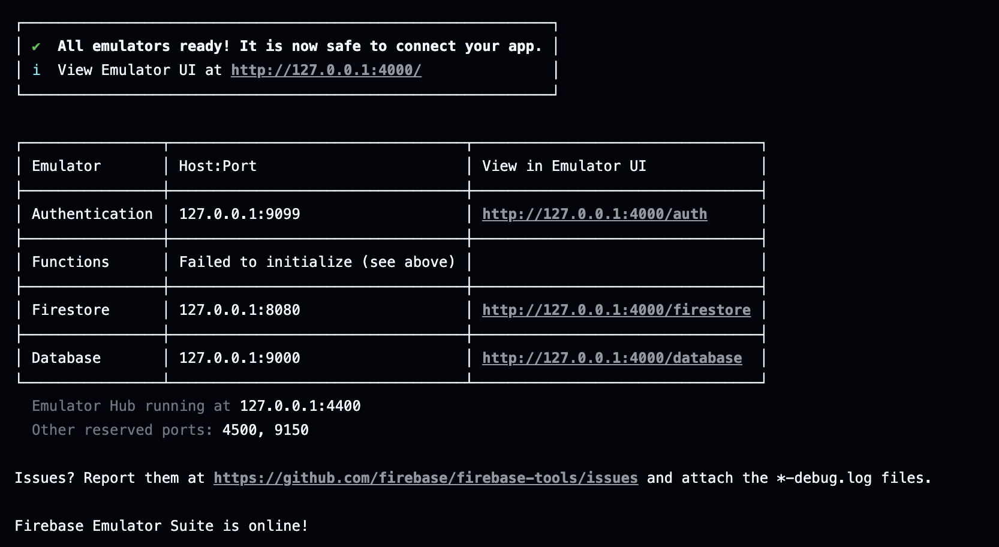

# Firebase Emulator Action Example

This is an example usage of the [Firebase Emulator Action](https://github.com/invertase/firebase-emulator-action) which is GitHub Action that enables you to start and configure the Firebase Emulator Suite for testing and development.

